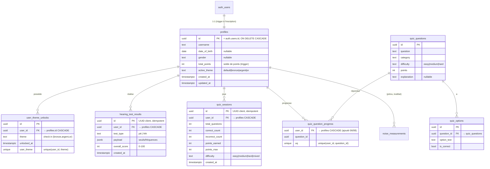
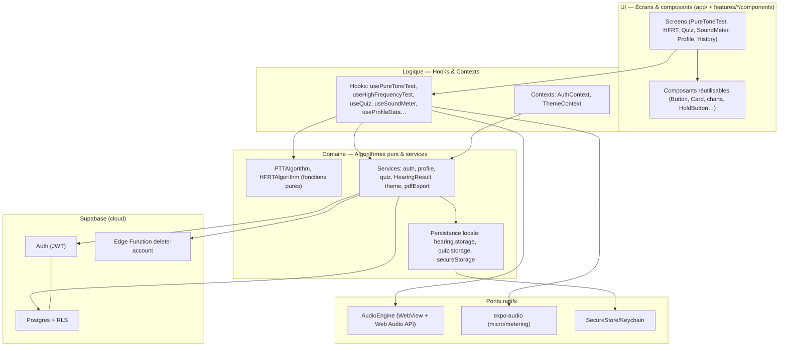
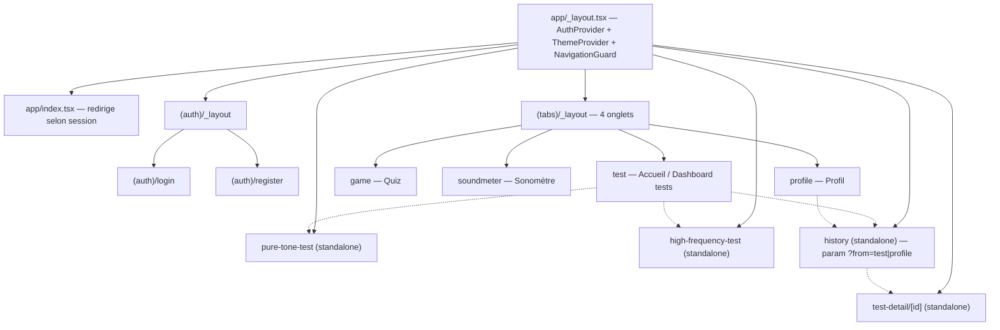

# Rapport d'analyse technique — HearSafe (EarHealth)

> **But de ce document.** Fournir la matière **factuelle** extraite du code réel
> pour alimenter le rapport écrit et la défense du TFE. Chaque affirmation est
> ancrée sur un fichier/ligne. Les manques sont signalés `⚠️ ABSENT` (à produire)
> ou `NON TROUVÉ DANS LE CODE`. Les déductions non certaines sont préfixées
> `DÉDUIT (non confirmé)`.
>
> **Périmètre analysé :** intégralité du dépôt `EarHealth/` (branche
> `feature/hearing_test`), `package.json`, `tsconfig.json`, `app.json`,
> `eas.json`, `.github/`, `eslint.config.js`, `jest.config.js`, tous les dossiers
> `app/ features/ components/ constants/ src/ supabase/`, les migrations SQL, et
> l'historique Git complet (79 commits).
>
> **Documents compagnons déjà présents dans le dépôt** (à citer en annexe) :
> [SECURITY_AUDIT.md](SECURITY_AUDIT.md), [DATABASE_USAGE_REPORT.md](DATABASE_USAGE_REPORT.md),
> [DOC_TESTS_AUDITIFS.pdf](DOC_TESTS_AUDITIFS.pdf) (documentation algorithmique PTT/HFRT).

**Chiffres-clés (mesurés le 2026-08-08) :**

| Métrique | Valeur | Source |
|---|---|---|
| Code applicatif (hors tests) | **≈ 13 475 lignes**, 96 fichiers `.ts/.tsx` | `wc -l` sur `app features components constants src supabase` |
| Code de test | **≈ 4 425 lignes**, 41 fichiers `.test.*` | idem |
| Tests automatisés | **416 tests, 41 suites, 100 % passants** | `npm run test:coverage` |
| Couverture | Lignes **61,06 %** · Stmts 59,21 % · Branches 46,05 % · Fonctions 53,39 % | rapport Jest |
| Historique Git | **79 commits**, du **2026-03-08** au **2026-08-06** (≈ 5 mois) | `git log` |
| Branches | `main`, `develop`, `feature/hearing_test`, `feature/profile`, `feature/quizz`, `feature/sonometer` | `git branch -a` |

---

# ═══════════════════════════════════════
# PARTIE A — DONNÉES POUR LE RAPPORT ÉCRIT
# ═══════════════════════════════════════

## A1. Intervenants et utilisateurs

### Client / commanditaire
`NON TROUVÉ DANS LE CODE.` Aucun README, commentaire ou document ne nomme un
client, commanditaire ou porteur métier. Le [README.md](README.md) est le
gabarit générique `create-expo-app` non personnalisé.
⚠️ **ABSENT — à produire pour le rapport :** identification du client (projet
personnel ? demande d'un ORL / d'une mutuelle / d'un service de médecine du
travail ?), ou mention explicite qu'il s'agit d'un projet d'initiative propre.

### Types d'utilisateurs distingués par le code
Le code ne connaît **qu'un seul rôle applicatif** : l'**utilisateur authentifié**
(`authenticated` dans Supabase). Il n'existe **aucun rôle administrateur, modérateur
ou invité** côté application.

- L'authentification passe par Supabase Auth ; la session est exposée à toute
  l'app via [AuthContext.tsx](features/auth/context/AuthContext.tsx#L38-L122).
- Aucune notion de rôle/permission n'est stockée : le type `Profile`
  ([auth.types.ts](features/auth/types/auth.types.ts#L1-L16)) ne contient pas de
  champ `role`. `DÉDUIT (non confirmé)` : la table `profiles` n'a pas de colonne
  de rôle (aucune requête ne la lit).
- Le rôle `service_role` (privilégié) n'existe **que côté serveur**, dans la
  fonction Edge de suppression de compte
  ([delete-account/index.ts](supabase/functions/delete-account/index.ts#L53-L56)) —
  il n'est jamais présent dans l'app mobile.

### Ce qu'un utilisateur authentifié peut faire (tracé dans le code)
| Action | Où | Persistance |
|---|---|---|
| S'inscrire (email + mdp + pseudo + date de naissance + genre) | [RegisterScreen.tsx](features/auth/screens/RegisterScreen.tsx), [auth.service.ts](features/auth/services/auth.service.ts#L10-L24) | `auth.users` + trigger → `profiles` |
| Se connecter / se déconnecter | [LoginScreen.tsx](features/auth/screens/LoginScreen.tsx), [auth.service.ts](features/auth/services/auth.service.ts#L4-L29) | session chiffrée locale |
| Passer un test tonal (PTT, 500–4000 Hz, 2 oreilles) | [PureToneTestScreen.tsx](features/hearing-test/PureToneTestScreen.tsx), [usePureToneTest.ts](features/hearing-test/hooks/usePureToneTest.ts) | `hearing_test_results` |
| Passer un test hautes fréquences (HFRT, 8–20 kHz) | [HighFrequencyTestScreen.tsx](features/hearing-test/HighFrequencyTestScreen.tsx), [useHighFrequencyTest.ts](features/hearing-test/hooks/useHighFrequencyTest.ts) | `hearing_test_results` |
| Consulter l'historique + le détail des tests, l'évolution | [HistoryScreen.tsx](features/hearing-test/HistoryScreen.tsx), [TestDetailScreen.tsx](features/hearing-test/TestDetailScreen.tsx) | lecture RLS |
| Exporter ses résultats en PDF (par type/période) | [ExportSheet.tsx](features/profile/ExportSheet.tsx), [pdfExport.service.ts](features/profile/services/pdfExport.service.ts) | génération locale + partage |
| Mesurer le bruit ambiant (sonomètre) | [SoundMeterScreen.tsx](features/sound-meter/SoundMeterScreen.tsx), [useSoundMeter.ts](features/sound-meter/hooks/useSoundMeter.ts) | **non persisté** (temps réel) |
| Jouer au quiz de prévention (points) | [QuizScreen.tsx](features/quiz/QuizScreen.tsx), [useQuiz.ts](features/quiz/hooks/useQuiz.ts) | `quiz_sessions`, `quiz_question_progress` |
| Débloquer/sélectionner un thème de couleur avec ses points | [ThemeSheet.tsx](features/profile/ThemeSheet.tsx), [ThemeContext.tsx](features/theme/ThemeContext.tsx) | `user_theme_unlocks`, `profiles` |
| Modifier son profil (pseudo, genre, date de naissance) | [ProfileScreen.tsx](features/profile/ProfileScreen.tsx), [profile.service.ts](features/auth/services/profile.service.ts#L15-L27) | `profiles` |
| Supprimer définitivement son compte (+ toutes ses données) | [ProfileScreen.tsx](features/profile/ProfileScreen.tsx), Edge Function | cascade DB |

---

## A2. Fonctionnalités — User Stories + critères d'acceptation

> Les commits utilisent une nomenclature « US3/US4/US5 » (ex.
> `feat(sound-meter): vibration au franchissement du seuil de 85 dB (US5)`), ce
> qui **atteste l'existence d'un backlog de User Stories numérotées**. Le backlog
> lui-même n'est pas dans le dépôt (`⚠️ ABSENT` — voir A3).

### US-1 — Test auditif tonal (PTT) `IMPLÉMENTÉ`
> *En tant qu'utilisateur, je veux mesurer mon seuil auditif par fréquence sur
> chaque oreille, afin de suivre ma capacité auditive dans le temps.*

- **Critères d'acceptation (déduits du code) :**
  - Test des fréquences 500, 1000, 2000, 4000 Hz
    ([PTTAlgorithm.ts:15](features/hearing-test/services/PTTAlgorithm.ts#L15)),
    oreille gauche puis droite.
  - Méthode « appui maintenu = j'entends » ; l'intensité descend quand on
    maintient, remonte quand on relâche (escalier adaptatif).
  - Convergence après **6 renversements** (1er écarté), moyenne des renversements
    ([PTTAlgorithm.ts:104-131](features/hearing-test/services/PTTAlgorithm.ts#L104-L131)).
  - Sécurité anti-blocage : timeout 45 s/fréquence, avertissement d'inactivité.
  - Résultat = PTA-4 (moyenne 500-4000 Hz)
    ([PTTAlgorithm.ts:155-159](features/hearing-test/services/PTTAlgorithm.ts#L155-L159)),
    audiogramme, comparaison avec le test précédent.
  - Sauvegarde résiliente offline-first (voir A7).
- **Fichiers :** hook [usePureToneTest.ts](features/hearing-test/hooks/usePureToneTest.ts),
  algo [PTTAlgorithm.ts](features/hearing-test/services/PTTAlgorithm.ts),
  vue [PTTTestingView.tsx](features/hearing-test/components/PTTTestingView.tsx) /
  [PTTResultView.tsx](features/hearing-test/components/PTTResultView.tsx),
  graphe [AudiogramChart.tsx](features/hearing-test/components/AudiogramChart.tsx).
- **Complexité : ÉLEVÉE.** Escalier psychoacoustique (Békésy / Hughson-Westlake
  modifié) à deux phases, gestion fine du temps (pulses 250/350 ms), état
  algorithmique en `ref` pour être immunisé au cycle de rendu React.

### US-2 — Test des hautes fréquences (HFRT) `IMPLÉMENTÉ`
> *En tant qu'utilisateur, je veux connaître la fréquence la plus aiguë que
> j'entends encore, afin de détecter une presbyacousie précoce.*

- **Critères :** balayage 8 kHz → 20 kHz, escalier **multiplicatif (logarithmique)**
  ([HFRTAlgorithm.ts:47-52](features/hearing-test/services/HFRTAlgorithm.ts#L47-L52)) ;
  limite = **moyenne géométrique** des renversements
  ([HFRTAlgorithm.ts:72-77](features/hearing-test/services/HFRTAlgorithm.ts#L72-L77)) ;
  cas particuliers gérés : *plafond* atteint (20 kHz), *aucune réponse*, *stall*
  (10 s sans renversement) ; interprétation **relative à l'âge**
  ([HFRTAlgorithm.ts:172-194](features/hearing-test/services/HFRTAlgorithm.ts#L172-L194)).
- **Fichiers :** [useHighFrequencyTest.ts](features/hearing-test/hooks/useHighFrequencyTest.ts),
  [HFRTAlgorithm.ts](features/hearing-test/services/HFRTAlgorithm.ts),
  [HFRTSpectrumChart.tsx](features/hearing-test/components/HFRTSpectrumChart.tsx).
- **Complexité : ÉLEVÉE** (modèle âge, bandes de qualité partagées comme source
  de vérité unique, cf. commentaire [HFRTAlgorithm.ts:128-148](features/hearing-test/services/HFRTAlgorithm.ts#L128-L148)).

### US-3 — Synthèse sonore temps réel (moteur audio) `IMPLÉMENTÉ`
> *En tant qu'utilisateur, je veux entendre des sons purs précis (fréquence,
> volume, oreille gauche/droite), afin que le test soit fiable.*

- Génération par **oscillateur Web Audio API** dans une **WebView cachée**
  ([AudioEngine.tsx](features/hearing-test/audio/AudioEngine.tsx),
  HTML embarqué [hearing-test.constants.ts:168-293](features/hearing-test/constants/hearing-test.constants.ts#L168-L293)),
  panoramique stéréo gauche/droite, fondus d'entrée/sortie anti-clic.
- **Complexité : ÉLEVÉE** (pont natif↔WebView, contrainte plateforme, cf. A7).

### US-4 — Sonomètre / mesure du bruit ambiant `IMPLÉMENTÉ`
> *En tant qu'utilisateur, je veux mesurer le niveau sonore autour de moi et être
> alerté au-delà de 85 dB, afin de protéger mon audition.*

- Mesure via micro (`expo-audio` en natif, Web Audio `AnalyserNode` sur le web),
  calcul **RMS → dB** ([useSoundMeter.ts:70-82](features/sound-meter/hooks/useSoundMeter.ts#L70-L82)),
  moyenne glissante, alerte **haptique** au franchissement de 85 dB avec
  **hystérésis** anti-spam ([useSoundMeter.ts:59-66](features/sound-meter/hooks/useSoundMeter.ts#L59-L66)).
  Seuil de risque NIOSH/OMS explicite (`RISK_THRESHOLD_DB = 85`,
  [sound-level.constants.ts:66-68](features/sound-meter/constants/sound-level.constants.ts#L66-L68)).
- **Critère non tenu :** la mesure **n'est pas calibrée** (dB non absolus, offset
  `+80` empirique). C'est assumé — pas de persistance des mesures.
- **Complexité : MOYENNE.**

### US-5 — Quiz de prévention gamifié `IMPLÉMENTÉ`
> *En tant qu'utilisateur, je veux répondre à un quiz éducatif et gagner des
> points, afin d'apprendre en me motivant.*

- Banque de questions en base (`quiz_questions` + `quiz_options`), mélange
  **Fisher-Yates** non biaisé ([quiz.service.ts:32-39](features/quiz/services/quiz.service.ts#L32-L39)),
  filtrage par catégorie/difficulté, **stale-while-revalidate** (cache local),
  score, points, statistiques (précision, meilleure session, **couverture de
  questions distinctes**), historique, confirmation avant de quitter.
- **Anti-triche/anti-double-comptage :** les points sont crédités par un trigger
  DB `AFTER INSERT` et l'`id` de session est idempotent
  ([quiz.service.ts:62-81](features/quiz/services/quiz.service.ts#L62-L81)).
- **Fichiers :** [useQuiz.ts](features/quiz/hooks/useQuiz.ts),
  [quiz.service.ts](features/quiz/services/quiz.service.ts),
  [useQuizStats.ts](features/quiz/hooks/useQuizStats.ts).
- **Complexité : ÉLEVÉE** (offline-first idempotent + agrégation de stats).

### US-6 — Thèmes achetables (récompense) `IMPLÉMENTÉ`
> *En tant qu'utilisateur, je veux dépenser mes points pour débloquer des thèmes
> de couleur (bronze/argent/or), afin de personnaliser l'app.*

- Achat **atomique** via fonction SQL `purchase_theme()` (`security definer`,
  verrou de ligne `for update`) — déblocage stocké dans **une table de récompense
  dédiée** `user_theme_unlocks`, pas une colonne
  ([20260806_theme_unlocks.sql](supabase/migrations/20260806_theme_unlocks.sql)).
  Choix d'architecture explicitement demandé (motif « badge/récompense »).
- **Fichiers :** [ThemeContext.tsx](features/theme/ThemeContext.tsx),
  [theme.service.ts](features/theme/services/theme.service.ts),
  [theme.constants.ts](features/theme/theme.constants.ts).
- **Complexité : MOYENNE-ÉLEVÉE** (transaction, condition de course traitée).

### US-7 — Gestion de compte & données (RGPD) `IMPLÉMENTÉ`
> *En tant qu'utilisateur, je veux modifier mon profil, exporter mes données et
> supprimer mon compte, afin de garder le contrôle de mes données de santé.*

- Édition profil, export PDF (portabilité), **suppression totale via Edge
  Function + cascade DB** (droit à l'effacement — voir A9/A10).

### Fonctionnalités `PARTIEL` / `PRÉVU MAIS ABSENT`
- **Historique du sonomètre :** la table `noise_measurements` existe et est
  **conservée volontairement** pour une future fonctionnalité, mais **aucun code
  client ne l'écrit ni ne la lit** (cf. [DATABASE_USAGE_REPORT.md](DATABASE_USAGE_REPORT.md)).
  → `PRÉVU MAIS ABSENT`.
- **Détection de casque :** service [HeadphoneDetector.ts](features/hearing-test/services/HeadphoneDetector.ts)
  présent **et testé**, mais **plus branché** dans l'UI (le commit `aa3db03` a
  retiré la logique de détection ; seul un *gate* pédagogique
  [HeadphoneGateView.tsx](features/hearing-test/components/HeadphoneGateView.tsx)
  demande de confirmer le port du casque). → **code mort** (voir B2).
- **Comparaison à un cahier des charges :** impossible, aucun CDC n'est versionné
  (`⚠️ ABSENT`, voir A3).

---

## A3. Méthodologie et organisation (via Git)

- **Volume & période :** 79 commits, du **2026-03-08** (`f1ab238 chore: initialize
  HearSafe project`) au **2026-08-06** (`f6f40e7 chore(db): version schema
  migrations`). ≈ **5 mois** de travail.
- **Convention de commits :** *Conventional Commits* (`feat:`, `fix:`, `chore:`,
  `refactor:`, scopes `feat(hearing-test):`, `feat(quiz):`…). Signe de rigueur.
- **Références de suivi visibles :** numéros de User Stories (`(US3)`, `(US4)`,
  `(US5)`) et numéros d'issues/PR GitHub (`#9`, `#17`, `#18`, `#20`, `#24`,
  `Merge pull request #24 from dekubruu/feature/profile`). → **usage de GitHub
  Issues + Pull Requests** comme outil de gestion.

### Phases lisibles dans l'historique (regroupement par thème/période)
| Phase | Période | Contenu (commits) |
|---|---|---|
| **P1 — Amorçage & moteur audio** | mars → avr. 2026 | init projet, 1er test auditif, remplacement du service audio par la classe `AudioEngine`, page sonomètre |
| **P2 — Backend & Auth** | fin avr. → mai 2026 | intégration Supabase (`5155ab0`), flux login/register, date de naissance & genre, refactor structure |
| **P3 — Tests auditifs matures** | mai → juil. 2026 | PTT + HFRT, headphone gate, conseils personnalisés, algo HFRT (reversals, inactivité), **documentation technique PTT/HFRT** (`258e46c`) |
| **P4 — Profil, sonomètre, offline** | juin 2026 | ProfileScreen finalisé, export données, vibration 85 dB (US5), affichage dB cohérent |
| **P5 — Quiz, thèmes, historique, PDF** | 4–5 août 2026 | history/detail, PDF export, thèmes tiered, quiz history & stats, confirmation de sortie |
| **P6 — Tests, sécurité, DB, packaging** | 6 août 2026 | **suite de tests massive**, correctifs sécurité, table `user_theme_unlocks`, suppression de compte, versionnement des migrations |

### Rythme & intensité
Cadence de commits par jour (extrait) : `2026-05-08 → 7`, `2026-08-04 → 12`,
`2026-08-05 → 12`, `2026-08-06 → 6`. → Développement **par sprints** avec pics
d'intensité, et une **forte accélération finale** (industrialisation : tests +
sécurité + packaging) plutôt qu'un flux constant. `DÉDUIT (non confirmé)` : les
longues plages entre commits (ex. mai→juin) correspondent à des phases de
développement local non commitées ou à d'autres cours.

### Développement incrémental (MVP → itérations)
- **Branches par feature** : `feature/hearing_test`, `feature/profile`,
  `feature/quizz`, `feature/sonometer`, intégrées via `develop` puis `main`
  (Git Flow simplifié). Plusieurs `Merge pull request #…` et `Merge branch
  'develop' into feature/…` attestent d'un flux de branches réel.
- Traces d'itération honnêtes dans les messages : `67c5a25 … working great on
  IOS but bad on WEB`, `a31d1f6 fix`, `2fa9eec Refactor for readability`.

### Outils de gestion visibles
- CI GitHub Actions ([.github/workflows/test.yml](.github/workflows/test.yml)).
- Pas de fichier de board (Projects/Jira/Trello) versionné.
  ⚠️ **ABSENT — à produire :** capture du board GitHub Projects / du backlog de
  User Stories, et le **cahier des charges**, pour documenter la méthodologie.

---

## A4. Positionnement de la solution

- **Concurrents / apps existantes :** `NON TROUVÉ DANS LE CODE`. Aucune analyse
  concurrentielle n'est présente. ⚠️ **ABSENT — à produire :** comparatif avec
  Mimi Hearing Test, uHear, Hörtest, SonicHearing, apps sonomètre (NIOSH SLM,
  Decibel X)… et positionnement (gratuit, francophone, multi-outils : test tonal
  + HF + sonomètre + prévention).
- **Choix d'architecture qui distinguent d'une approche naïve** (eux, factuels) :
  1. **Offline-first idempotent** : les résultats sont durables **avant** tout
     appel réseau, avec file d'attente locale et rejeu sûr (`ON CONFLICT DO
     NOTHING`) — cf. [quiz.service.ts:144-207](features/quiz/services/quiz.service.ts#L144-L207),
     [HearingResultService.ts:72-126](features/hearing-test/services/HearingResultService.ts#L72-L126).
     Une app naïve perdrait les données sur coupure réseau.
  2. **Séparation stricte algorithme pur / effets** : les algorithmes PTT/HFRT
     sont des fonctions **pures et testables** ; les hooks orchestrent le temps
     et l'audio. Permet 416 tests sans device.
  3. **Source de vérité unique** pour les seuils de qualité (bandes HFRT) et pour
     la propriété des thèmes (table dédiée), évitant les incohérences d'UI.
  4. **Sécurité par conception** : suppression de compte côté serveur (jamais la
     clé `service_role` dans le bundle), session chiffrée au repos.

---

## A5. Analyse technique — choix de dépendances justifiés

> Versions exactes lues dans [package.json](package.json). Runtime : **Expo SDK
> ~54.0.33, React Native 0.81.5, React 19.1.0, TypeScript ~5.9.2**, *New
> Architecture* activée (`newArchEnabled: true`) et **React Compiler** activé
> (`experiments.reactCompiler: true`, [app.json:50-53](app.json)).

### Dépendances structurantes

| Dépendance | Version | Usage réel (fichiers) | Alternative & justification |
|---|---|---|---|
| **expo** | ~54.0.33 | toute l'app, build EAS | *vs React Native CLI* : Expo gère le natif (audio, secure-store, build cloud) sans Android Studio/Xcode local → gain de temps considérable pour un seul développeur. Limite : dépendances natives restreintes au catalogue Expo/config-plugins. |
| **expo-router** | ~6.0.23 | navigation `app/` (file-based), `typedRoutes` | *vs React Navigation nu* : routage par fichiers, typé, deep-linking gratuit. Construit **au-dessus** de React Navigation (aussi présent). |
| **@supabase/supabase-js** | ^2.105.0 | tous les services (`.from`, `.rpc`, `auth`, `functions`) | *vs backend custom (Node/Express + Postgres) ou Firebase* : BaaS = Auth + Postgres + RLS + Edge Functions sans écrire de serveur. Postgres (relationnel, contraintes, triggers) plutôt que Firestore (NoSQL) → intégrité forte, adaptée à des données de santé structurées. |
| **react-native-webview** | 13.15.0 | [AudioEngine.tsx](features/hearing-test/audio/AudioEngine.tsx) | Héberge un oscillateur **Web Audio API**. *vs* lecture de fichiers `.wav` pré-générés (`expo-av`) : la Web Audio API produit un sinus **exact, continu, glissable en fréquence** sans allocation ni artefact — indispensable pour l'audiométrie. Voir A7. |
| **expo-audio** | ~1.1.1 | sonomètre (metering micro) + `setAudioModeAsync` | *vs* `expo-av` (déprécié). Fournit `useAudioRecorder` + metering temps réel. |
| **@react-native-async-storage/async-storage** | ^2.2.0 | files offline (quiz/hearing), cache stats, session (chiffrée) | *vs SQLite (`expo-sqlite`)* : les besoins de persistance locale sont des **files de faible volume** (JSON) et un **cache**, pas des requêtes relationnelles → clé-valeur suffit et reste simple. La relation vit côté Postgres. |
| **expo-secure-store** + **aes-js** | ~15.0.8 / ^3.1.2 | [secureStorage.ts](src/utils/secureStorage.ts) | Chiffre la session (JWT + refresh token) au repos : clé AES-256 dans le Keychain/Keystore, blob chiffré dans AsyncStorage (motif « LargeSecureStore » recommandé par Supabase). *vs* session en clair dans AsyncStorage (défaut, non sécurisé). |
| **expo-crypto** | ~15.0.9 | UUID idempotents, clés aléatoires | `randomUUID` (id stables de sessions) + `getRandomBytes` (clé AES). |
| **react-native-svg** | 15.12.1 | audiogramme, spectre HFRT, courbe d'évolution | Graphiques **dessinés à la main** (maîtrise totale du rendu médical). *vs* lib de charts : évite une dépendance lourde pour 3 graphes spécifiques. |
| **expo-print** + **expo-sharing** + **expo-file-system** | ~15.0.8 / ~14.0.8 / ~19.0.23 | [pdfExport.service.ts](features/profile/services/pdfExport.service.ts) | Génère un PDF (HTML→PDF) et le partage. *vs* lib PDF JS : `expo-print` est natif et léger. |
| **expo-haptics** | ~15.0.8 | alerte 85 dB sonomètre | retour haptique (vibration) au franchissement de seuil. |
| **expo-linear-gradient** | ~15.0.8 | héros/dégradés (thèmes) | rendu des palettes tiered. |
| **react-native-reanimated** / **-worklets** / **-gesture-handler** | ~4.1.1 / 0.5.1 / ~2.28.0 | animations, bouton « maintenir » | dépendances de la New Architecture + interactions. |

### Choix structurants — argumentaire reconstruit (pour le rapport)

- **Expo vs React Native CLI** → *Avantages* : build cloud EAS, modules natifs
  prêts (audio, crypto, secure-store), OTA possible, un seul dev sans toolchain
  native. *Inconvénients/limites* : couplé au calendrier de versions Expo,
  modules natifs hors-catalogue plus difficiles. **Cohérent** ici : toutes les
  fonctions natives utilisées (micro, audio, keychain, print) sont dans le
  catalogue Expo.
- **Supabase (BaaS) vs backend custom** → *Avantages* : Auth + Postgres + RLS +
  Edge Functions livrés, sécurité au niveau ligne, zéro serveur à maintenir.
  *Inconvénients* : verrouillage fournisseur, logique métier sensible à
  externaliser en Edge Functions (fait pour la suppression de compte). **Postgres
  relationnel** justifié par des données structurées et des contraintes
  d'intégrité (FK cascade, triggers, fonctions).
- **WebView + Web Audio API vs audio natif** → voir A7 (challenge central).
- **AsyncStorage vs SQLite** → clé-valeur suffit pour des **files JSON** et un
  **cache** ; la complexité relationnelle est déléguée à Postgres. Évite une
  dépendance native supplémentaire et une couche ORM.

---

## A6. Conception — éléments pour diagrammes

### A6.1 — Schéma de base de données (reconstruit du code + migrations)

> Reconstruit depuis les requêtes `.from()`/`.rpc()`, les types TypeScript, et les
> migrations SQL. Tables **réellement utilisées** confirmées par grep
> ([DATABASE_USAGE_REPORT.md](DATABASE_USAGE_REPORT.md)). `DÉDUIT (non confirmé)`
> pour les types de colonnes non prouvés par une migration versionnée (le schéma
> initial a été créé via le dashboard Supabase, non versionné).



**Éléments serveur confirmés :**
- **Trigger `bump_profile_points`** : `AFTER INSERT` sur `quiz_sessions`,
  incrémente `profiles.total_points` (documenté [quiz.service.ts:62-66](features/quiz/services/quiz.service.ts#L62-L66)).
- **Fonction `purchase_theme(target_theme text, target_cost int)`** :
  `security definer`, verrou `for update`, débit + déblocage atomiques
  ([20260806_theme_unlocks.sql:47-82](supabase/migrations/20260806_theme_unlocks.sql#L47-L82)).
- **RLS** : activée ; `user_theme_unlocks` n'a qu'une policy `SELECT` (aucun
  `INSERT` client — passage obligé par `purchase_theme`). Les autres tables sont
  filtrées par `auth.uid() = user_id` (voir A10 + [SECURITY_AUDIT.md](SECURITY_AUDIT.md)).
- **Cascade FK** : `auth.users → profiles → {hearing_test_results, quiz_sessions,
  quiz_question_progress, noise_measurements, user_theme_unlocks}`
  ([20260806_add_cascade_fk.sql](supabase/migrations/20260806_add_cascade_fk.sql)).
- **Tables supprimées** (mortes, confirmé par audit) : `badges`, `user_badges`,
  `user_points_log`, `quiz_session_answers`
  ([20260806_drop_unused_tables.sql](supabase/migrations/20260806_drop_unused_tables.sql)).

⚠️ **ABSENT — à produire :** un `schema.sql` complet et versionné de la base
initiale (types/contraintes exacts), aujourd'hui seulement partiellement décrit
par les 3 migrations. Le reste est `DÉDUIT` du code.

### A6.2 — Diagramme d'architecture (couches)



**Flux de données « sauvegarde d'un test » (offline-first) :** hook → service
`saveHearingResultResilient` → **1)** écriture durable AsyncStorage (file) →
**2)** upsert Supabase idempotent → **3)** si succès, purge de la file ; sinon
statut `queued` et rejeu au prochain retour au premier plan
([AuthContext.tsx:82-107](features/auth/context/AuthContext.tsx#L82-L107)).

### A6.3 — Diagramme de navigation (Expo Router)



- **Garde de navigation** ([_layout.tsx:6-34](app/_layout.tsx#L6-L34)) : redirige
  vers `/(auth)/login` si non connecté, vers `/(tabs)/test` si connecté hors
  zone autorisée. Les écrans « standalone » authentifiés doivent figurer dans
  `STANDALONE_ROUTES` sinon ils sont silencieusement redirigés.
- **Retour contextuel** de l'historique : `history?from=profile` renvoie au
  profil, sinon à l'accueil ([HistoryScreen.tsx:64-76](features/hearing-test/HistoryScreen.tsx#L64-L76)).

### A6.4 — Organigramme de l'algorithme PTT (audiométrie tonale)

```
DÉBUT (oreille = gauche, freq = 500 Hz, dB = 40)
 └─► À chaque cycle de pulse (600 ms) :
      ├─ Jouer le son 250 ms puis silence 350 ms
      ├─ Lire l'état du bouton (maintenu = "j'entends")
      ├─ MAINTENU  → dB = dB − pas    (phase 1: −10 / phase 2: −3)
      │  RELÂCHÉ   → dB = dB + pas    (phase 1: +5  / phase 2: +3)
      ├─ Changement de direction (maintenu↔relâché) ? → RENVERSEMENT
      │     └─ 1er renversement → passer en phase 2 (pas fins ±3)
      ├─ Inactivité > 8 s (après 4 s de grâce) ? → afficher un avertissement
      └─ CONVERGÉ ? (6 renversements  OU  timeout 45 s)
            ├─ NON → cycle suivant
            └─ OUI → seuil = moyenne des renversements (1er écarté)
                     ├─ freq suivante ? → recommencer à dB=40
                     ├─ sinon, oreille gauche finie → passer à droite
                     └─ sinon (droite finie) → RÉSULTAT
RÉSULTAT : PTA-4 = moyenne(seuils 500/1k/2k/4k) par oreille
           → sauvegarde résiliente + audiogramme
```
(Réf. [usePureToneTest.ts:106-164](features/hearing-test/hooks/usePureToneTest.ts#L106-L164),
[PTTAlgorithm.ts](features/hearing-test/services/PTTAlgorithm.ts).
Variante HFRT identique mais sur l'axe **fréquence** avec pas **multiplicatifs**
et moyenne **géométrique**.)

---

## A7. Cas pratique — challenges techniques réels

### C1 — Générer un son pur précis en React Native → WebView + Web Audio API `CHALLENGE CENTRAL`
- **Problème :** React Native n'a pas d'oscillateur audio natif ; jouer des
  fichiers `.wav` pré-enregistrés est inexact (fréquences discrètes, artefacts,
  pas de glissando continu pour le balayage HFRT).
- **Solution (dans le code) :** une **WebView cachée (1×1 px, opacité 0)** exécute
  un oscillateur **Web Audio API**, piloté par `injectJavaScript` depuis le natif
  ([AudioEngine.tsx:29-50](features/hearing-test/audio/AudioEngine.tsx#L29-L50)).
  Panoramique stéréo gauche/droite, fondus anti-clic, glissando de fréquence.
- **Extrait :**
  ```ts
  // AudioEngine.tsx — appel natif → JS de la WebView, valeurs échappées via JSON.stringify
  webViewRef.current?.injectJavaScript(
    `window.playTone && window.playTone(${JSON.stringify(f)}, ${JSON.stringify(v)}, ${JSON.stringify(channel)}); true;`
  );
  ```
- **Bug résolu documenté :** un pont manquant a rendu `setFrequency()` silencieux,
  bloquant le balayage HFRT. Le commentaire de correction est resté :
  > *« RESTORED: without this, audio.setFrequency() was a silent no-op and the
  > tone stayed stuck on the playTone() start frequency. »*
  ([hearing-test.constants.ts:271-286](features/hearing-test/constants/hearing-test.constants.ts#L271-L286)).
  → Bon exemple TFE : *un pont WebView manquant échoue silencieusement*.

### C2 — Son coupé par le mode silencieux iOS (contournement)
- **Problème/solution :** sans configurer la session audio, les tons sont coupés
  par l'interrupteur silencieux iOS. Commentaire explicatif conservé :
  ```ts
  // AudioEngine.tsx:52-60 — playsInSilentMode: true, allowsRecording: false
  setAudioModeAsync({ playsInSilentMode: true, allowsRecording: false })
  ```

### C3 — Fiabilité des sauvegardes sans réseau (offline-first idempotent)
- **Problème :** l'app peut être tuée entre la fin d'un test/quiz et la réponse
  du serveur → perte de données de santé.
- **Solution :** durabilité **avant** réseau (file AsyncStorage), `id` client
  généré **une seule fois**, upsert `ON CONFLICT DO NOTHING` (rejeu sûr), file
  vidée au démarrage et au retour premier-plan, **single-flight guard** contre les
  flush concurrents. Zones les plus élaborées du code, très commentées :
  [quiz.service.ts:144-267](features/quiz/services/quiz.service.ts#L144-L267),
  [HearingResultService.ts:72-175](features/hearing-test/services/HearingResultService.ts#L72-L175),
  [hearing.storage.ts:116-203](features/hearing-test/services/hearing.storage.ts#L116-L203).

### C4 — État algorithmique vs cycle de rendu React
- **Problème :** un escalier temps réel (pulses, timers) ne peut pas dépendre de
  `useState` (asynchrone, provoque des courses).
- **Solution :** l'état de l'algo vit dans des `ref` (`stateRef`, `heldRef`),
  immunisés au rendu ; `useState` ne sert qu'à l'affichage
  ([usePureToneTest.ts:49-60](features/hearing-test/hooks/usePureToneTest.ts#L49-L60)).

### C5 — Condition de course sur l'achat de thème
- **Problème :** deux achats simultanés pourraient débiter deux fois / débloquer
  sans payer.
- **Solution :** tout se fait dans **une fonction SQL atomique** avec `for update`
  (verrou de ligne), `security definer` et `auth.uid()` (impossible d'agir sur
  autrui) ([20260806_theme_unlocks.sql:47-82](supabase/migrations/20260806_theme_unlocks.sql#L47-L82)).

### C6 — Cohérence multi-plateforme (web vs natif)
- Sonomètre en **deux implémentations** (Web Audio `AnalyserNode` vs `expo-audio`
  metering) derrière une API de hook unique
  ([useSoundMeter.ts](features/sound-meter/hooks/useSoundMeter.ts)) ; adaptateur
  de stockage web vs `LargeSecureStore` natif
  ([supabase.ts:9-25](src/utils/supabase.ts#L9-L25)). Le commit `67c5a25`
  (« working great on IOS but bad on WEB ») témoigne du travail de convergence.

> Note : `grep` sur `TODO|FIXME|HACK|XXX` → **aucun** dans `features/`. Les seuls
> `eslint-disable` sont 5 désactivations ciblées et justifiées de
> `react-hooks/exhaustive-deps` sur des effets à dépendances volontairement
> partielles (hooks temps réel). Base de code **propre**.

---

## A8. Validation et tests

- **Framework :** Jest ~29.7 + `jest-expo` ~54 + `@testing-library/react-native`
  ^13.2 ([jest.config.js](jest.config.js), [package.json:59-70](package.json#L59-L70)).
- **Volume :** **416 tests, 41 suites, 100 % passants** ; couverture **lignes
  61,06 %** (Stmts 59,21 %, Branches 46,05 %, Fonctions 53,39 %).
- **Nature des tests :** unitaires (algorithmes purs PTT/HFRT, services quiz/
  hearing, `secureStorage`, `theme.service`), d'intégration de hooks
  (`usePureToneTest`, `useHighFrequencyTest`, `useQuiz` avec *fake timers*),
  et de composants/écrans (`RegisterScreen`, `ProfileScreen`,
  `PureToneTestScreen`, `HighFrequencyTestScreen`, vues sonomètre/quiz) via RNTL.
- **Justesse des mesures (audiométrie/dB) :** vérifiée par tests unitaires **de
  l'algorithme**, pas de l'électro-acoustique. Ex. : convergence de l'escalier,
  moyenne des renversements, moyenne **géométrique** HFRT, PTA-4, `computeAge`,
  bandes de qualité. La justesse **absolue en dB** n'est **pas** validée (appareil
  non calibré — c'est explicitement assumé, voir disclaimers A9).
  ⚠️ **ABSENT — à produire :** protocole de **validation manuelle sur devices
  réels** (l'app dépend du matériel : casque, plateforme). Rien n'est documenté
  côté procédure de test manuel.
- **Validation d'entrées & cas limites (présents) :**
  - Formulaire d'inscription : pseudo ≥ 3, email regex, **mot de passe ≥ 8**,
    confirmation ([RegisterScreen.tsx:51-65](features/auth/screens/RegisterScreen.tsx#L51-L65)).
  - Clamps physiques audio (fréquence 20–22000 Hz, volume 0–1)
    ([AudioEngine.tsx:20-22,31-34](features/hearing-test/audio/AudioEngine.tsx#L20-L34)).
  - Garde-fous algo : timeouts, périodes de grâce, `noResponse`, `hitCeiling`,
    `stall`.
  - Validation défensive des données locales relues (schema guards
    [hearing.storage.ts:128-169](features/hearing-test/services/hearing.storage.ts#L128-L169)).
  - Gestion d'erreurs : services `throw` sur erreur Supabase ; lectures
    secondaires en *soft-fail* (retour `[]`/`0` + `console.warn`) pour ne pas
    faire tomber l'écran ([quiz.service.ts:345-360](features/quiz/services/quiz.service.ts#L345-L360)).
- **CI :** [.github/workflows/test.yml](.github/workflows/test.yml) exécute
  `npm run test:coverage --ci` sur **chaque push et chaque PR** (toutes branches).
- **Mesures de performance :** `NON TROUVÉ DANS LE CODE` (aucun benchmark, aucun
  profiling versionné). ⚠️ **ABSENT.**

---

## A9. Législation et données personnelles (RGPD)

### Données de santé traitées
Oui. L'app collecte et stocke des **données de santé** (seuils auditifs, limite
haute fréquence) et des **données personnelles** (email, pseudo, **date de
naissance**, **genre**). Stockage : table `hearing_test_results` (payload JSONB)
sur **Supabase (Postgres)**. Transmission chiffrée TLS (HTTPS Supabase). Session
locale **chiffrée au repos** (AES-256 + Keychain, [secureStorage.ts](src/utils/secureStorage.ts)).

### Éléments RGPD **présents** dans le code
- **Droit à l'effacement** (art. 17) : suppression **totale** du compte et de
  toutes les données via Edge Function + **cascade FK**
  ([delete-account/index.ts](supabase/functions/delete-account/index.ts),
  [ProfileScreen.tsx](features/profile/ProfileScreen.tsx) — double confirmation).
- **Droit à la portabilité** (art. 20, partiel) : export **PDF** des résultats
  ([pdfExport.service.ts](features/profile/services/pdfExport.service.ts)).
- **Minimisation / cloisonnement** : RLS stricte, `auth.uid()`, aucune donnée
  d'autrui accessible.
- **Consentement micro** : demandé explicitement à l'usage
  (`requestRecordingPermissionsAsync`, [useSoundMeter.ts:135-139](features/sound-meter/hooks/useSoundMeter.ts#L135-L139)) ;
  permissions Android déclarées (`RECORD_AUDIO`, `MODIFY_AUDIO_SETTINGS`,
  [app.json:22-25](app.json)).
- **Non-diagnostic / clause de non-responsabilité** : disclaimer répété sur les
  écrans de résultat, l'historique, le PDF et l'accueil :
  > *« Informations fournies à titre indicatif et éducatif. Cette application
  > réalise un dépistage sur matériel non calibré et ne pose aucun diagnostic
  > médical. Pour toute évaluation ou décision, consultez un professionnel de
  > santé (médecin ORL, audiologiste). »*
  ([hearing-info.ts:19-22](features/hearing-test/constants/hearing-info.ts#L19-L22),
  repris [TestDashboardScreen.tsx:346](features/hearing-test/TestDashboardScreen.tsx#L346),
  [PTTResultView.tsx:181](features/hearing-test/components/PTTResultView.tsx#L181),
  [HFRTResultView.tsx:161](features/hearing-test/components/HFRTResultView.tsx#L161),
  [pdfExport.service.ts:392](features/profile/services/pdfExport.service.ts#L392)).

### Éléments RGPD **absents** (à produire)
- ⚠️ **ABSENT :** aucune **politique de confidentialité** ni **CGU** dans l'app ou
  le dépôt.
- ⚠️ **ABSENT :** aucune **case de consentement explicite** au traitement des
  données (santé) à l'inscription — seul le consentement micro est demandé.
- ⚠️ **ABSENT :** aucune **politique de conservation** (durée de rétention) ni
  mention de la **localisation du serveur** Supabase (région UE ?) — à documenter,
  crucial pour des données de santé.
- ⚠️ **ABSENT :** confirmation email activée (l'inscription attend une
  confirmation, [RegisterScreen.tsx:95-114](features/auth/screens/RegisterScreen.tsx#L95-L114))
  mais **base légale / registre de traitement** non documentés.

---

## A10. Sécurité (risques → contre-mesures)

> Synthèse ; détail complet et note dans [SECURITY_AUDIT.md](SECURITY_AUDIT.md)
> (audit réel mené sur ce code, corrections appliquées dans les commits
> `e4b8fed`, `018d5b2`, `89d030c` + actions dashboard).

| Élément à protéger | Risque | Contre-mesure dans le code |
|---|---|---|
| **Authentification** | Vol d'identifiants, session détournée | Supabase Auth (JWT + refresh), `autoRefreshToken`, `persistSession` ; mot de passe hashé côté Supabase ; politique mdp ≥ 8 ([supabase.ts:27-38](src/utils/supabase.ts#L27-L38)) |
| **Autorisation / accès données** | Lire/modifier les données d'un autre user | **RLS** activée, filtre `auth.uid() = user_id` sur toutes les tables ; `user_theme_unlocks` **sans INSERT client** ; les `.eq('user_id', …)` client sont un confort, la vraie frontière est la RLS |
| **Stockage session (repos)** | Extraction du token sur appareil compromis | **Chiffrement AES-256**, clé en Keychain/Keystore, blob chiffré en AsyncStorage ([secureStorage.ts](src/utils/secureStorage.ts)) — corrige F1 |
| **Secrets (clés Supabase)** | Clé secrète exposée dans le bundle/Git | `.env` **non versionné** (confirmé `git ls-files`) ; seule la clé **publishable** (non secrète par nature) est côté client ; la clé `service_role` **uniquement** en Edge Function ; artefact de build fuité supprimé + clé publishable **rotée** (F5) |
| **Opérations privilégiées** | Escalade (suppression d'un autre compte) | `deleteUser` **côté serveur**, id pris **exclusivement** du JWT vérifié, jamais d'un paramètre client ([delete-account/index.ts:35-58](supabase/functions/delete-account/index.ts#L35-L58)) |
| **Injection (WebView)** | Injection JS via valeurs interpolées | Toutes les valeurs injectées passent par `JSON.stringify`, clamps numériques ([AudioEngine.tsx:31-49](features/hearing-test/audio/AudioEngine.tsx#L31-L49)) — corrige F8 |
| **Communications réseau** | Interception (MITM) | HTTPS/TLS géré par Supabase (URL `https://`). **Absent :** *certificate pinning* |
| **Fuite de logs** | Données sensibles en clair dans les logs | `console.log` audio gardé derrière `__DEV__` ([AudioEngine.tsx:81-83](features/hearing-test/audio/AudioEngine.tsx#L81-L83)) — corrige F9 |
| **Intégrité à la suppression** | Données orphelines après effacement | **Cascade FK** complétée (`quiz_question_progress` était le trou) — corrige la faille F3 en profondeur |

### Ce qui manque pour une vraie production (honnête)
- ⚠️ Pas de **monitoring / crash-reporting** (Sentry…) intégré.
- ⚠️ Pas de **certificate pinning**.
- ⚠️ **Sauvegardes / plan de reprise** : reposent sur les backups Supabase par
  défaut, non documentés/testés.
- ⚠️ Vulnérabilités npm résiduelles (voir [SECURITY_AUDIT.md](SECURITY_AUDIT.md),
  section vulns transitives).
- ⚠️ Environnement **unique** (le projet Supabase de dev = celui utilisé pour les
  tests jury) : pas de séparation prod/staging.

---

# ═══════════════════════════════════════════════
# PARTIE B — DONNÉES POUR LA RÉALISATION PRATIQUE
# ═══════════════════════════════════════════════

## B1. Ampleur et complexité

- **Volume total :** ≈ **13 475 lignes** de code applicatif (96 fichiers) +
  ≈ **4 425 lignes** de tests (41 fichiers) = **≈ 17 900 lignes** TypeScript.
- **Répartition par feature (hors tests) :**

  | Feature | Lignes | Poids |
  |---|---|---|
  | `hearing-test` (PTT + HFRT + audio + charts + historique + export) | **6 998** | ~52 % |
  | `quiz` | **2 685** | ~20 % |
  | `profile` (dont export PDF) | **1 481** | ~11 % |
  | `auth` | **769** | ~6 % |
  | `sound-meter` | **565** | ~4 % |
  | `theme` | **160** | ~1 % |
  | `components/` + `constants/` + `app/` + `src/` | ~800 | ~6 % |

- **Charge de travail estimée (honnête) :** projet mobile **complet et non
  trivial** — 4 features majeures indépendantes, un moteur audio maison, un moteur
  de persistance offline-first idempotent, un backend Postgres avec RLS/triggers/
  fonctions/Edge Functions, 416 tests, une CI et un packaging APK. Sur ≈ 5 mois en
  solo, cela représente un **volume conséquent et cohérent** avec un TFE de BAC 3.
- **Les deux piliers de la formation TI, concrètement mobilisés :**
  - **Développement logiciel** : app mobile TypeScript stricte, architecture en
    couches, hooks, tests automatisés, CI, algorithmes psychoacoustiques.
  - **Base de données** : modèle relationnel Postgres, RLS, triggers, fonction
    transactionnelle `security definer`, intégrité référentielle (cascade FK),
    migrations SQL versionnées.
  - **Réseau / systèmes** : client/serveur (BaaS), JWT, HTTPS/TLS, Edge Function
    (Deno serverless), synchronisation offline/online, permissions natives.

## B2. Technicité et bonnes pratiques

**Bonnes pratiques observées (factuel) :**
- **TypeScript strict** activé ([tsconfig.json:3-4](tsconfig.json#L3-L4)) + alias
  de chemins `@/*`.
- **Séparation des responsabilités** nette : `screens` (UI) / `hooks`
  (orchestration) / `services` (I/O) / algorithmes purs / `types`.
- **Algorithmes purs et testables** isolés des effets → 416 tests sans device.
- **Composants réutilisables** (`Button`, `Card`, `DateField`, `GenderSelector`,
  charts SVG, `HoldButton`, `InfoTooltip`).
- **Gestion d'état propre** : Context pour l'auth et le thème, `ref` pour l'état
  temps réel, `useMemo`/`useCallback` maîtrisés.
- **Source de vérité unique** (bandes de qualité HFRT, propriété des thèmes).
- **Commits conventionnels**, branches par feature, CI sur PR.
- **Sécurité par conception** (session chiffrée, secrets serveur, RLS).

**Technologies non triviales mises en œuvre :**
- **Synthèse audio temps réel** (oscillateur Web Audio dans WebView, glissando,
  stéréo).
- **Algorithmes psychoacoustiques** (Békésy / Hughson-Westlake modifié, moyenne
  géométrique log, modèle âge).
- **Offline-first idempotent** (file durable, UUID stables, `ON CONFLICT DO
  NOTHING`, single-flight).
- **Transaction SQL atomique** avec verrou de ligne (achat de thème).

**Points faibles techniques (honnêtes, à connaître) :**
- **Code mort** : [HeadphoneDetector.ts](features/hearing-test/services/HeadphoneDetector.ts)
  (+ son test) n'est plus branché dans l'UI depuis le commit `aa3db03`.
- **Duplication assumée** : `hearing.storage.ts` et `quiz.storage.ts` partagent le
  même motif (file/mutex/single-flight) **volontairement non factorisé**
  (commenté [hearing.storage.ts:3-6](features/hearing-test/services/hearing.storage.ts#L3-L6)) —
  choix défendable (évolution indépendante) mais reste de la duplication.
  Idem : le dégradé « HERO_GRADIENT » dupliqué sur plusieurs écrans (noté dans
  [theme.constants.ts:7-10](features/theme/theme.constants.ts#L7-L10)).
- **Couverture de branches modérée (46 %)** : les écrans riches en JSX
  conditionnel (résultats, export) sont moins couverts que le domaine.
- **Schéma DB initial non versionné** : seules 3 migrations récentes existent ; le
  reste du schéma est implicite (dashboard). Manque de reproductibilité.
- **Table `noise_measurements`** conservée mais inutilisée (dette « au cas où »).
- **`app.json`** : `predictiveBackGestureEnabled: false` et pas de version code
  Android géré manuellement (le profil `production` gère `autoIncrement`, pas
  `preview`).

## B3. Validation automatisée / CI-CD

- **Pipeline CI :** [.github/workflows/test.yml](.github/workflows/test.yml) —
  déclenché sur `push` **et** `pull_request` (toutes branches) ; étapes : checkout
  → Node 20 (cache npm) → `npm ci` → `npm run test:coverage --ci`. Simple,
  reproductible, bloque les régressions.
- **Scripts npm** ([package.json:5-15](package.json#L5-L15)) : `start`, `android`,
  `ios`, `web`, `lint` (`expo lint`), `test`, `test:watch`, `test:coverage`.
- **Lint :** ESLint 9 flat config + `eslint-config-expo`
  ([eslint.config.js](eslint.config.js)).
- **Build / déploiement EAS :** [eas.json](eas.json) — profils `development`
  (dev client, distribution interne), **`preview` (APK, distribution interne)** →
  celui utilisé pour l'APK jury, `production` (`autoIncrement`, AAB store).
  `app.json` renseigne `android.package = com.dekubruu.hearsafe`,
  `extra.eas.projectId`, `owner = mybrother`. Build cloud reproductible via
  `npx eas-cli build --profile preview --platform android`.
- ⚠️ **ABSENT / améliorable :** la CI **ne lance pas `lint` ni `tsc`** (seulement
  les tests) ; **pas de build automatique** EAS sur tag/release ; pas de
  déploiement automatisé de l'Edge Function.

## B4. Sécurité et législation (réalisation — ce qui est effectivement en place)

- **Chiffrement en transit :** HTTPS/TLS (Supabase) pour toutes les requêtes ;
  Edge Function en HTTPS.
- **Chiffrement au repos (local) :** **oui** — session AES-256, clé en
  Keychain/Keystore ([secureStorage.ts](src/utils/secureStorage.ts)). Les files
  offline (résultats/quiz en attente) restent en **clair** dans AsyncStorage
  (`DÉDUIT` : contiennent des scores/seuils, pas des identifiants — risque faible,
  mais à mentionner).
- **Chiffrement au repos (serveur) :** délégué à Supabase/Postgres (au niveau
  infrastructure) — non configuré dans le dépôt.
- **Contrôle d'accès effectif :** RLS + JWT + opérations privilégiées côté serveur
  uniquement.
- **RGPD effectif :** effacement total (cascade), export PDF, consentement micro,
  disclaimers non-diagnostic **présents** ; **politique de confidentialité,
  consentement données de santé, rétention : à produire** (voir A9).

---

## CHECKLIST DES MANQUES (⚠️ ABSENT — à produire avant la soutenance)

**Documentation / rapport (non-code) :**
- [ ] **Cahier des charges** versionné + **backlog de User Stories** (les commits
      référencent US3/US4/US5 mais le backlog n'est pas dans le dépôt).
- [ ] **Identification du client / commanditaire** (aucune trace dans le code).
- [ ] **Analyse concurrentielle** et positionnement (A4).
- [ ] **Capture du board GitHub Projects** / preuve d'organisation de projet.
- [ ] **Politique de confidentialité + CGU** (RGPD).
- [ ] **Consentement explicite au traitement des données de santé** à l'inscription.
- [ ] **Politique de conservation** des données + **région d'hébergement** Supabase.
- [ ] **Protocole de validation manuelle sur devices réels** (casques,
      plateformes) — le cœur de valeur (audio) dépend du matériel.
- [ ] **Mesures de performance / benchmarks** (aucune dans le code).
- [ ] **`schema.sql` complet et versionné** de la base initiale (aujourd'hui
      seulement 3 migrations ; le reste est déduit du code).
- [ ] **README projet** réel (le README actuel est le gabarit Expo générique).

**Améliorations de réalisation (code) — optionnelles mais valorisantes :**
- [ ] Étendre la CI à `lint` + `tsc --noEmit` (actuellement tests seuls).
- [ ] Supprimer le **code mort** `HeadphoneDetector.ts` (+ test) ou le rebrancher.
- [ ] Intégrer un **crash-reporting** (Sentry) et documenter monitoring/backup.
- [ ] Séparer environnements **prod/staging** Supabase (aujourd'hui un seul).
- [ ] (Sécurité) certificate pinning, résorber les vulns npm transitives
      restantes (cf. [SECURITY_AUDIT.md](SECURITY_AUDIT.md)).

---
*Rapport généré par analyse statique du dépôt à l'état du commit `f6f40e7`
(2026-08-06), sur la branche `feature/hearing_test`. Chiffres de test/couverture
mesurés le 2026-08-08.*
